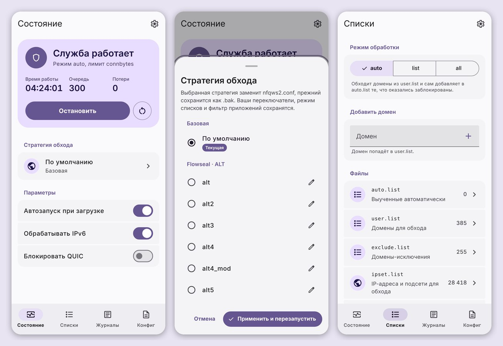
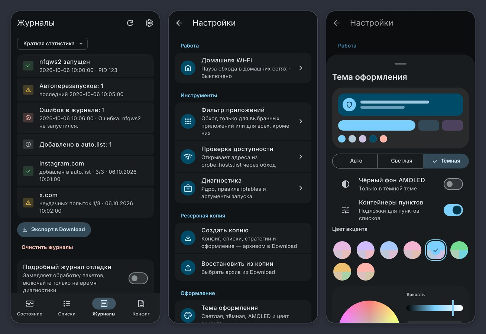

# nfqws2 for Android

Полнофункциональный порт **nfqws2** ([zapret2](https://github.com/bol-van/zapret) от bol-van) с поддержкой синтаксиса стратегий Keenetic для Android.

Модуль предназначен для обхода ТСПУ/DPI **нативно на уровне ядра** через подсистему `netfilter` (NFQUEUE). В отличие от VPN-приложений (V2Ray, ByeDPI и др.), этот метод **не создает виртуального сетевого интерфейса (tun)**, не расходует дополнительный заряд батареи и не режет скорость соединения.

💬 Вопросы, подбор стратегий и новости — в Telegram-чате проекта: **[t.me/nfqws2android](https://t.me/nfqws2android)**

---

## ⚡ Особенности

* **Нативная работа через NFQUEUE**: модификация пакетов «на лету» без поднятия локального VPN-сервиса.
* **Поддержка LuaJIT и Blobs**: полная совместимость со сложными стратегиями (fake, multisplit, multidisorder, circular, payload modifications).
* **Готовые стратегии по группам**: Flowseal ALT, FAKE TLS AUTO, SIMPLE FAKE и авторские пресеты. Любую можно отредактировать прямо в WebUI и в один тап вернуть к исходнику.
* **Импорт конфигов nfqws2-keenetic**: файлы приводятся к виду встроенных стратегий и появляются в выборе стратегии. Можно импортировать сразу несколько.
* **Пауза в домашней Wi‑Fi сети**: если ваш роутер уже обходит DPI, модуль можно настроить на автоотключение в домашней сети.
* **Фильтрация приложений**: обход только для выбранных приложений или для всех, кроме них.
* **Журналы с краткой статистикой**: запуски, автоперезапуски, ошибки и домены, которые модуль сам добавил в `auto.list`. Фильтр «Ошибки» и подсветка синтаксиса.
* **Резервная копия**: конфиг, списки, стратегии и оформление — одним архивом в `Download`.
* **Обновления модуля из менеджера**: KernelSU, Magisk и APatch сами покажут, что вышла новая версия.
* **Полноценный WebUI на Material 3**: светлая, тёмная и AMOLED-тема, выбор акцента с обоев или на цветовом круге, русский и английский язык. Работает из менеджера (KernelSU / APatch) или через MMRL / KsuWebUI.

## 📋 Требования к системе

1. Установленный **KernelSU**, **APatch** или **Magisk** (v24+).
2. Архитектура процессора: **ARM64** (`arm64-v8a`), **ARM** (`armeabi-v7a`), **x86**, **x86_64**.

## 📥 Установка

1. Скачайте последний `.zip` архив из раздела [Releases](../../releases/latest).
2. Установите модуль через менеджер (KernelSU Manager, Magisk App или APatch).
3. Перезагрузите устройство.
4. Служба запустится автоматически при загрузке системы.

## 💬 Сообщество

Telegram-чат: **[t.me/nfqws2android](https://t.me/nfqws2android)** — помощь с настройкой, подбор стратегий под провайдера, новости о релизах.

---

## 🤝 Благодарности

* [bol-van](https://github.com/bol-van) — за оригинальный и непревзойденный проект zapret.
* [nfqws2-keenetic](https://github.com/nfqws/nfqws2-keenetic) — за идеи адаптации конфигов и логику авто-стратегий.
* [dpi-detector](https://github.com/Runnin4ik/dpi-detector) — за алгоритмы детекции и классификации блокировок DPI.
* [nfqws-menu](https://github.com/rndnaame/nfqws-menu) — за стратегии, блобы и списки адресов хостингов.
* Разработчикам [KernelSU](https://github.com/tiann/kernelSU), [Magisk](https://github.com/topjohnwu/magisk) и [APatch](https://github.com/bmax121/APatch).
